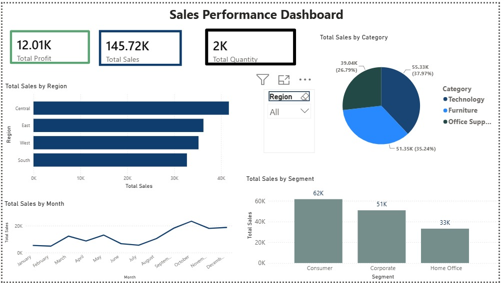

# 📊 Sales Performance Dashboard (Power BI)

## 📌 Project Overview

This project is an interactive Sales Performance Dashboard created using Microsoft Power BI.

The dashboard helps analyze sales performance, profit, quantity sold, regional performance, and monthly sales trends.

---

## 🛠 Tools Used

- Microsoft Power BI
- Power Query
- DAX
- Microsoft Excel

---

## 📈 Dashboard Features

- Total Sales KPI
- Total Profit KPI
- Total Quantity KPI
- Sales by Region
- Sales by Category
- Monthly Sales Trend
- Region Filter (Slicer)

---

## 📷 Dashboard Preview

---

## 📊 Dataset

Sample Superstore Dataset

---

## 📌 Key Insights

- Technology category generated the highest sales.
- Sales performance varies across different regions.
- Monthly sales trends help identify peak sales periods.
- Dashboard allows interactive filtering using Region slicer.

---

## 👩‍💻 Created By

Kavya R
